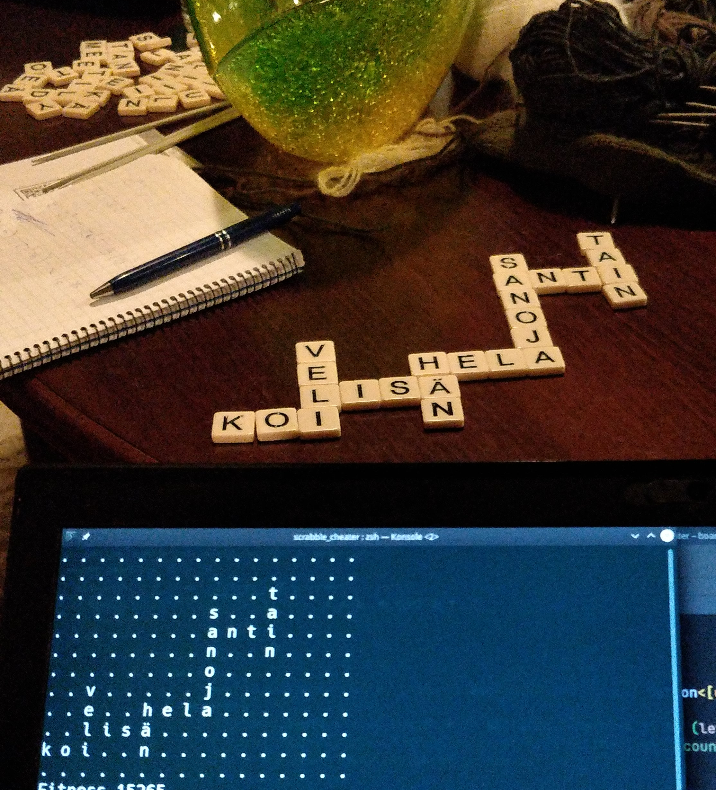

# Scrabble cheater

This is a word puzzle solver for "Bananagram" game. This does not solve a well known "Scrabble" game, even though name "scrabble cheater" suggests so. Bananagram is very similar to Scrabble. The objective is to arrange randomly given letter-tiles to Finnish words.

## Background
My sister gave Bananagram for our family as a Christmas present. She is very good at it. Because the best thing I can do is to cheat, I spent next week writing this program. (But hahaa who laughs now! 😝)

## Algorithm

This program uses Hastings algorithm underneath. Which is as follows:
1. Do a random move. Here one letter moved randomly.
2. Calculate a fitness. Here fitness is evaluated by counting number of full and partial words on the table.
3. Compare how did fitness change on this move. If the new arrangement is better than previous, then keep it. If it is worse, then keep the previous with some probability. The worse is new arrangement, the less likely it is to be accepted.
4. If current state is not solution, then repeat from part 1.

This algorithm does random moves that gets closer and closer to solution. Bad moves are accepted so that algorithm does not get stuck on local minima. This solver finds a solution with about 80% probability.

### Licence
Licence is MIT if that is legally possible. List of Finnish words are under LGPL licence, and I'm not sure whether it makes this program also a LGPL licenced.

Alpi Tolvanen
